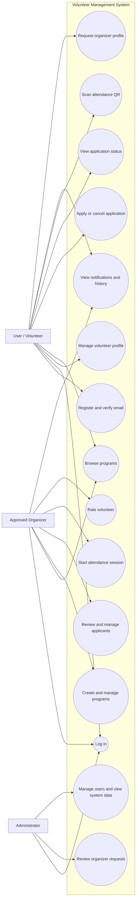
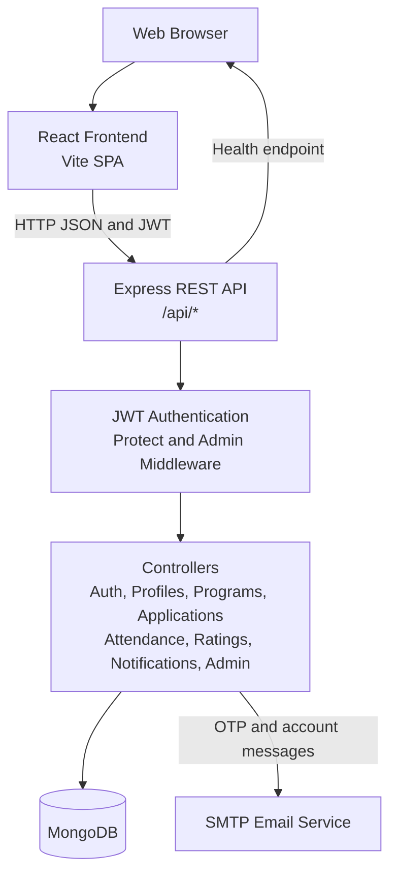
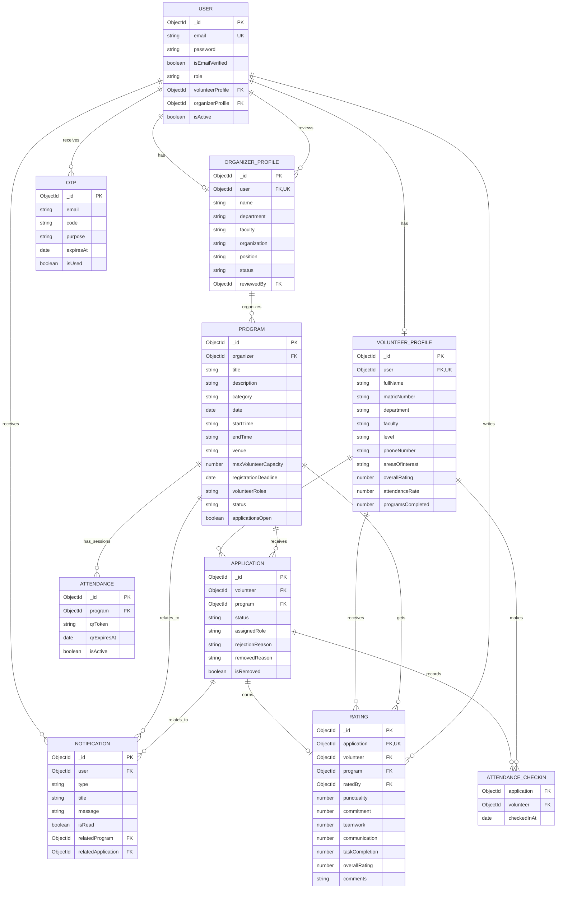
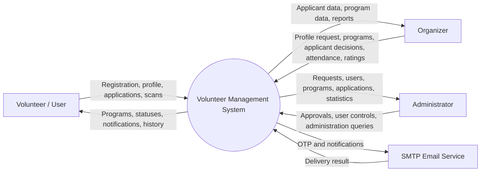
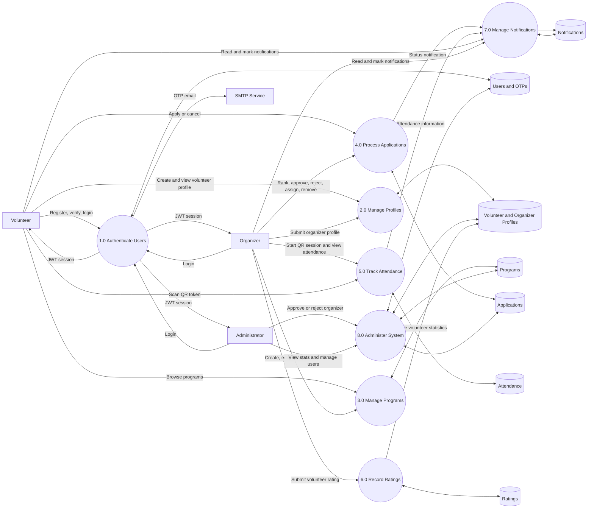
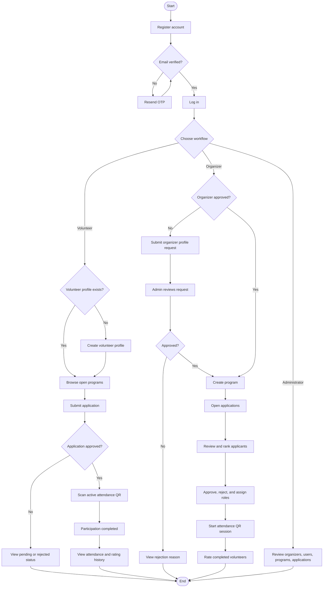
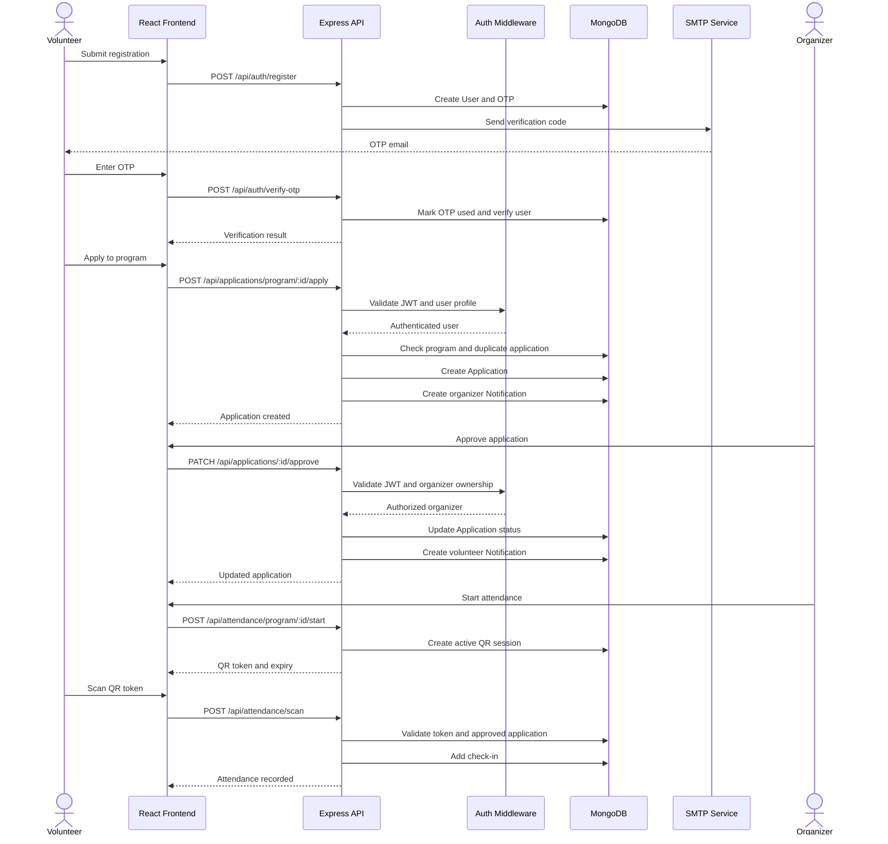
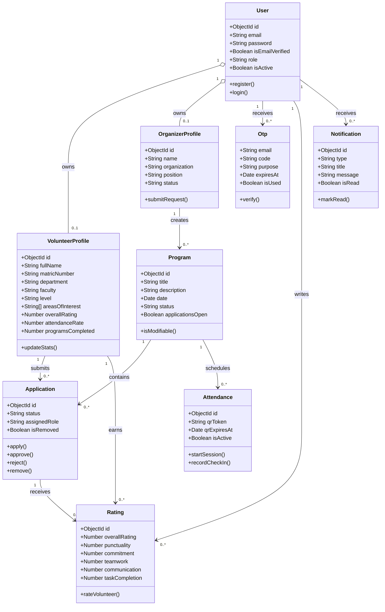
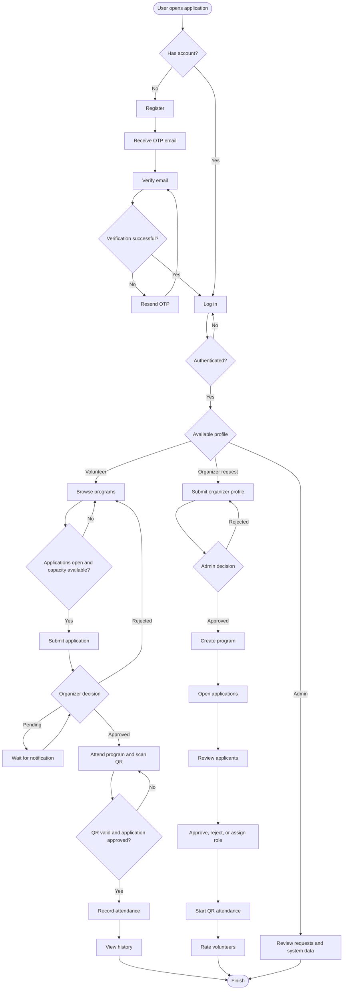

# Volunteer Management System Diagrams

These diagrams describe the current application structure and workflows. They use Mermaid and can be rendered by GitHub, GitLab, Mermaid Live, or a VS Code Mermaid preview extension.

## Image Files

1. [Use Case Diagram](diagrams-images/diagram-1.jpg)
2. [System Architecture Diagram](diagrams-images/diagram-2.jpg)
3. [ER Diagram](diagrams-images/diagram-3.jpg)
4. [DFD Level 0](diagrams-images/diagram-4.jpg)
5. [DFD Level 1](diagrams-images/diagram-5.jpg)
6. [Activity Diagram](diagrams-images/diagram-6.jpg)
7. [Sequence Diagram](diagrams-images/diagram-7.jpg)
8. [Class Diagram](diagrams-images/diagram-8.jpg)
9. [Flowchart](diagrams-images/diagram-9.jpg)

## 1. Use Case Diagram

## 2. System Architecture Diagram

## 3. ER Diagram

## 4. DFD Level 0

## 5. DFD Level 1

## 6. Activity Diagram

## 7. Sequence Diagram

## 8. Class Diagram

## 9. Flowchart

